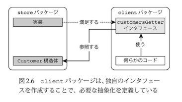
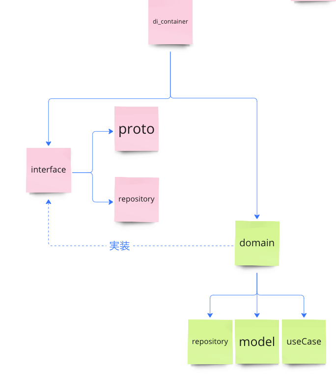

# CorrectCraft
## どういうAPI か
ユーザが英文法のアウトプットを気軽に行うことができるようにするアプリケーションのAPIサーバ

## 使っている技術
- 

# proto ファイルを使ったスキーマ定義ファイルの生成

## 新しいAPIを作成する場合の手順
1. proto ファイルを作成する
   1. server/proto 配下にディレクトリを作成する
      API の取り扱うトピックが異なる場合は、異なるディレクトリを作成するとわかりやすいかも。
      server/proto/<APIトピック>/v1/<APIトピック名>.proto
2. proto ファイルからスキーマ定義ファイルを生成する
下記コマンドを/server 配下で実行することで、/interface にconnect のスキーマ定義ファイルが生成される 
```sh
 buf generate
```


## bug.gen.yaml について
buf.gen.yaml は、buf が使用する設定ファイルです。
buf は、buf.gen.yaml を読み込み、その設定に従って、スキーマ定義ファイルを生成します。

## ドキュメント生成について
1. protobuf をinstall する
```shell
brew install protobuf
```

2. /server 配下で下記を入力
```sh
protoc \
  --doc_out=./doc \
  --doc_opt=markdown,index.md \
  ./**/*.proto

```
# ディレクトリ構造について

## di_container
依存関係の注入を行うためのディレクトリです。
## domain
ドメイン層のディレクトリです。
インターフェース層の実装を行うためのディレクトリです。
## interfaces
インターフェース層のディレクトリです。
repository, service などのinterface を置く場所です。
下記の状態を表現します。




## 各package の関係図

